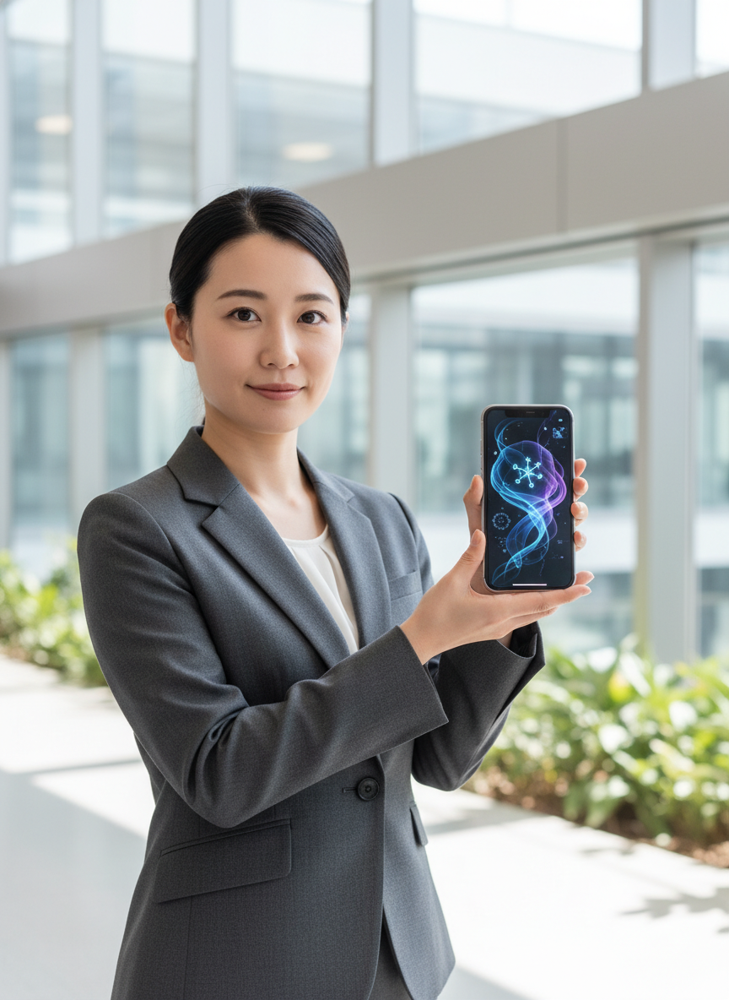
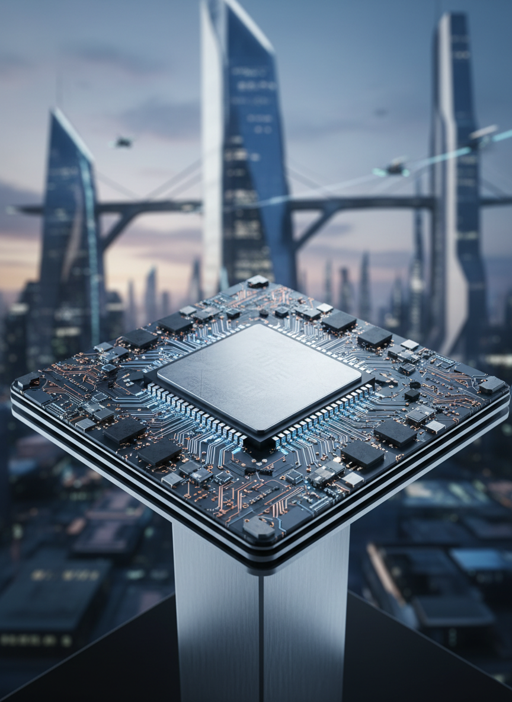
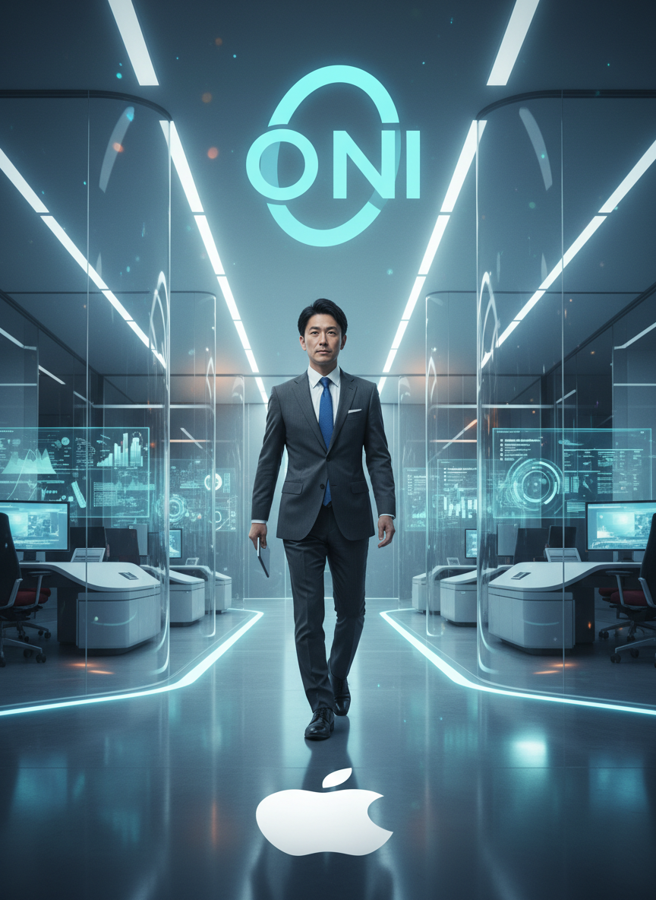
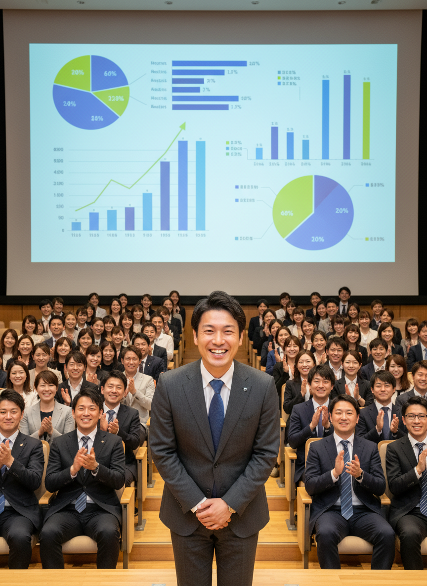

# AI/IT株式ニュース

2025/11/24

本日の注目トピック

---

# 📋 本日のサマリー

今日のAI/IT市場は、主要プレイヤー間の競争激化と大規模投資が特徴的です。AnthropicとOpenAIはそれぞれ新AIモデルやツールを発表し、GoogleもAIによるUI設計を進めるなど、AI技術の具体的な応用が加速しています。一方で、Amazonが米国政府機関向けAIサービスに最大500億ドルを投資する巨大な動きがある中、NVIDIAの高性能AIチップの対中輸出規制に関する米政府の動...

---

# 📰 M&A・企業買収

Tencent、Ubisoftの一部ユニットに大型投資

---

# 📰 M&A・企業買収

イタリア政府のサイバーセキュリティ戦略

---

# 📰 戦略的提携・パートナーシップ

Google、欧州でのAI未来構築へ意欲

---

# 📰 大型契約・受注

Amazon、米国政府機関向けAIサービスに500億ドル投資

---

# 📰 大型契約・受注

小規模AIスタートアップが米国政府契約を獲得

---

# 📊 まとめ

本日のレポートは以上です

ご視聴ありがとうございました
