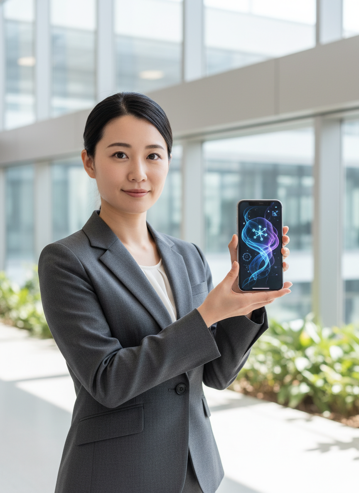
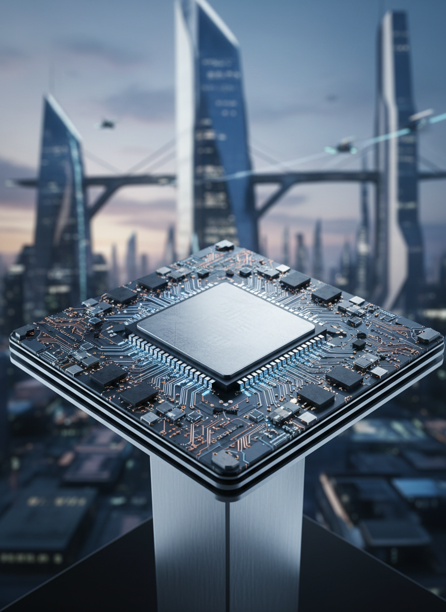
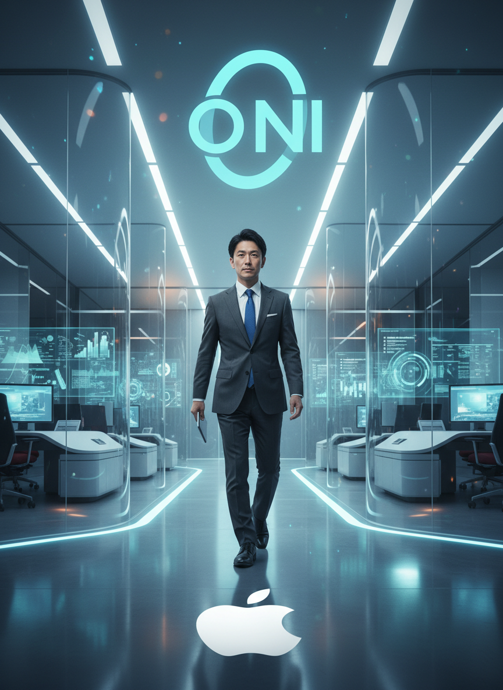
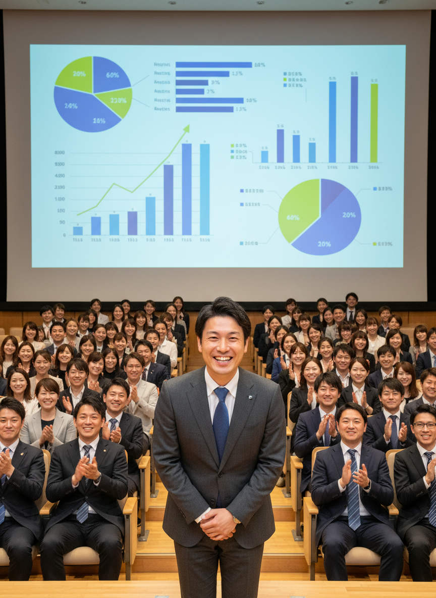

# AI/IT株式ニュース

2025/11/24

本日の注目トピック

---

# 📋 本日のサマリー

AI業界では、AlibabaがChatGPT対抗アプリ「Qwen」で強力なデビューを飾り、Appleは次期iOSにAI機能を統合するなど、大手テック企業による開発競争が激化しています。また、TeslaはカスタムAIチップの開発を加速させ、NVIDIAやOpenAIを中心とする経済圏における多様なAIハードウェア戦略が進展。AIブームによるメモリー部品の供給逼迫も継続しており、サプライチェーン...

---

# 📰 M&A・企業買収

GoTo GroupのCEO交代とGrabによる買収加速

---

# 📰 新製品・新技術

AlibabaのAIアプリ「Qwen」が好調なデビュー

---

# 📰 新製品・新技術

Apple iOS 27にAI機能を統合

---

# 📰 新製品・新技術

TeslaがカスタムAIチップ開発を加速

---

# 📰 人事

OpenAIがAppleエンジニアを引き抜き

---

# 📊 まとめ

本日のレポートは以上です

ご視聴ありがとうございました
