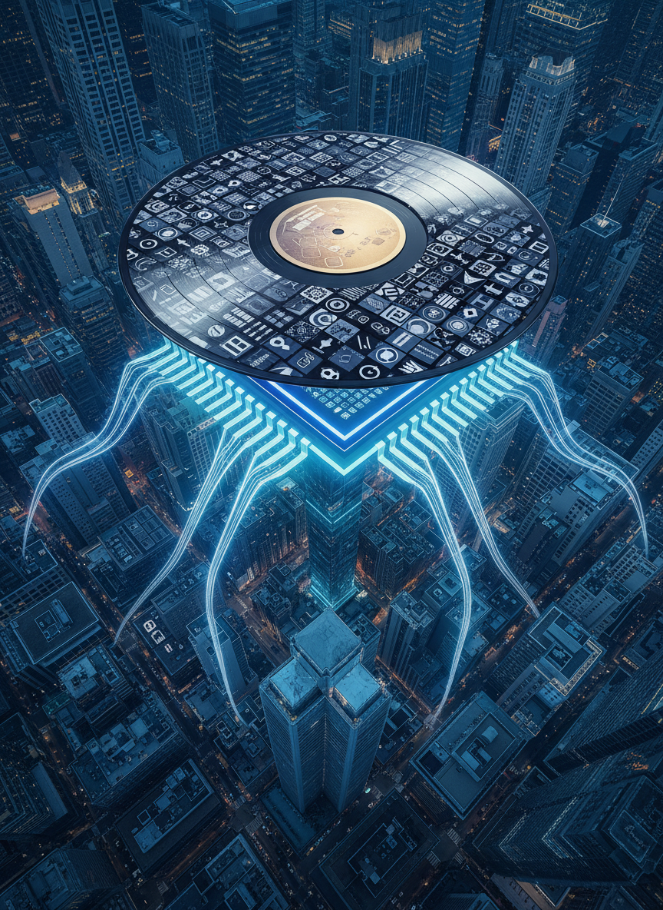
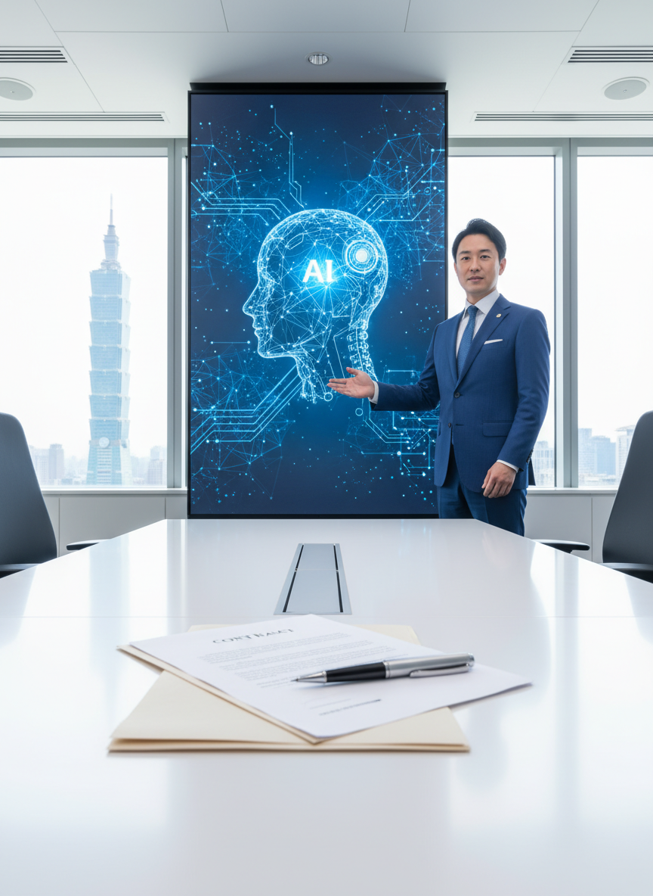
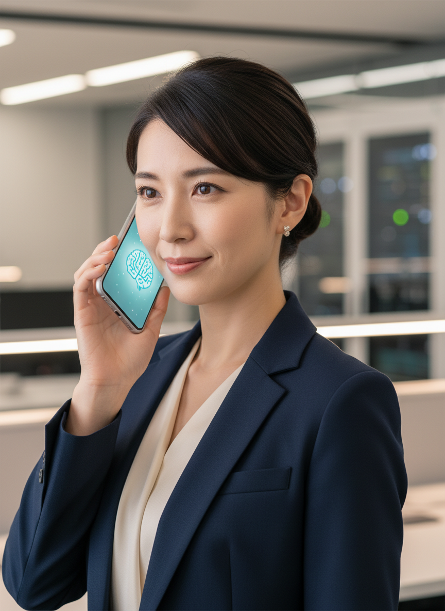

# AI/IT株式ニュース

2025/11/25

本日の注目トピック

---

# 📋 本日のサマリー

本日のAI/IT市場は、GoogleがAIチップ市場でNVIDIAの強力な競争相手として本格的に台頭し、Metaからの大型受注が報じられるなど、AIインフラ競争の激化が最も顕著な動きとなりました。GoogleはAIエージェントの実用化や既存製品へのAI統合も活発化させています。また、AIとコンテンツ業界間の協調（Warner MusicとSunoの和解）や、Alibaba、Ant Group...

---

# 📰 戦略的提携・パートナーシップ

GoogleとAccel AtomsがインドのAIイノベーションプログラムを共同開始

---

# 📰 戦略的提携・パートナーシップ

Warner MusicとAI音楽スタートアップSunoが著作権訴訟を和解し、新たな音楽制作パートナーシップに合意

---

# 📰 大型契約・受注

Meta PlatformsがGoogleのAIチップ（TPU）に数十億ドルを費やす可能性が浮上

---

# 📰 大型契約・受注

台湾の大富豪がプライベートクレジットファンドを通じて15億ドルをAI分野に投資

---

# 📰 新製品・新技術

GoogleがAIエージェントの「代理電話（Agentic Calling）」機能を提供開始

---

# 📊 まとめ

本日のレポートは以上です

ご視聴ありがとうございました
