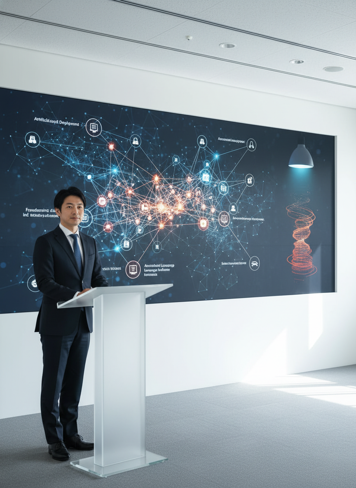
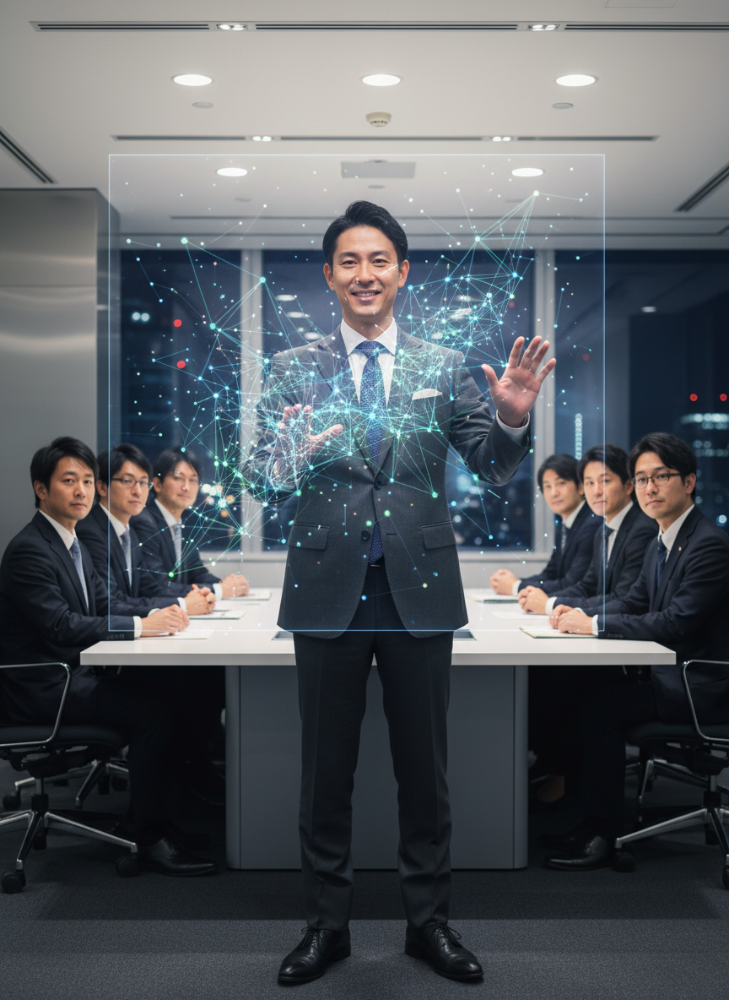
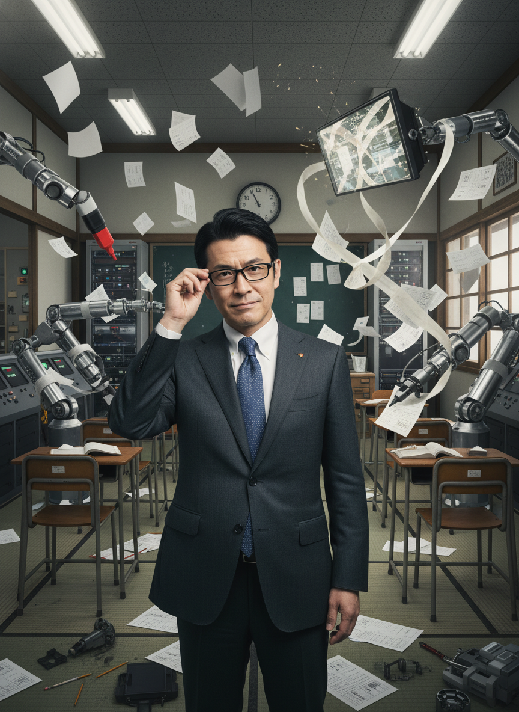

# AI/IT株式ニュース

2025/11/26

本日の注目トピック

---

# 📋 本日のサマリー

今日のAI/IT市場は、AIの具体的な社会実装とインフラ投資の活発化を示す一方で、その成長に伴う物理的制約や市場の過熱感、雇用への影響が顕在化しました。Googleは次世代AIモデル「Gemini 3」の進化を示し、AIとロボットの融合や自動運転の商用展開が進展。DellのAIサーバー販売予測上方修正は需要の強さを示すも、メモリチップや電力不足といったインフラ側の供給制約が懸念材料です。

---

# 📰 M&A・企業買収

デジタル決済

---

# 📰 M&A・企業買収

ゲーム

---

# 📰 M&A・企業買収

金融・仮想通貨

---

# 📰 M&A・企業買収

金融・仮想通貨

---

# 📰 新製品・新技術

AIモデル

---

# 📊 まとめ

本日のレポートは以上です

ご視聴ありがとうございました

---

# 🤖 塾頭高崎の完全自動化への挑戦

※このコンテンツはAIが自動生成しています

AI技術の限界に挑戦中！
共感いただけたらチャンネル登録・グッドボタンを
よろしくお願いします！
