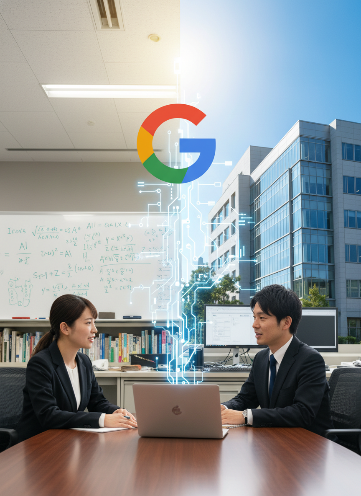
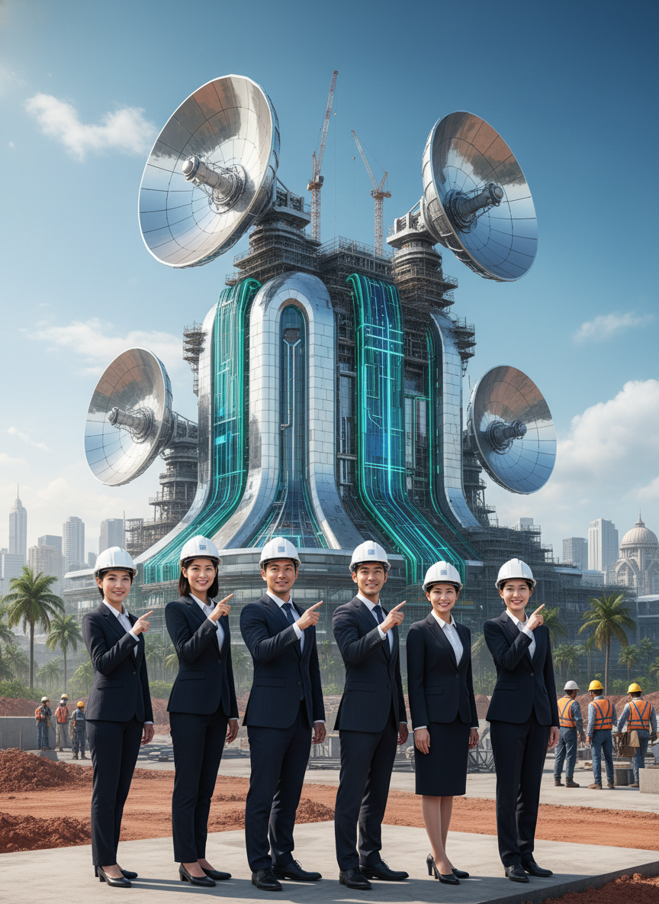
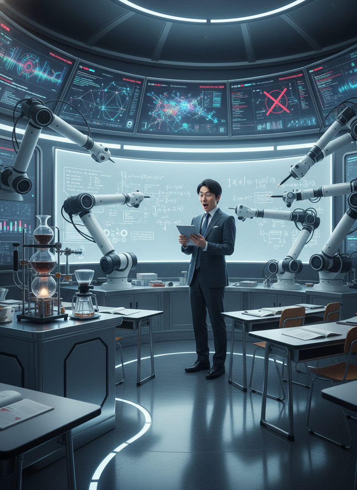

# AI/IT株式ニュース

2025/11/27

本日の注目トピック

---

# 📋 本日のサマリー

今日のAI/IT市場は、大手テック企業によるAIの多様な応用展開と、AIインフラへの大規模投資が加速していることを示しました。Google、OpenAI、Amazon、Alibabaは消費者向けAIサービスの競争を激化させる一方、AIの根幹を支えるデータセンターインフラの拡充に向けたM&Aや110億ドル規模の大型投資が発表されています。また、防衛分野でのAI活用や量子コンピューティングの進展...

---

# 📰 M&A・企業買収

データセンター事業者の買収競争

---

# 📰 戦略的提携・パートナーシップ

Googleと学術機関のAI研究提携深化

---

# 📰 戦略的提携・パートナーシップ

インドでのAIデータセンター合弁事業

---

# 📰 大型契約・受注

インドでの110億ドル規模AIデータセンター建設

---

# 📰 新製品・新技術

Googleの消費者向けAI体験

---

# 📊 まとめ

本日のレポートは以上です

ご視聴ありがとうございました

---

# 🤖 塾頭高崎の完全自動化への挑戦

※このコンテンツはAIが自動生成しています

AI技術の限界に挑戦中！
共感いただけたらチャンネル登録・グッドボタンを
よろしくお願いします！
