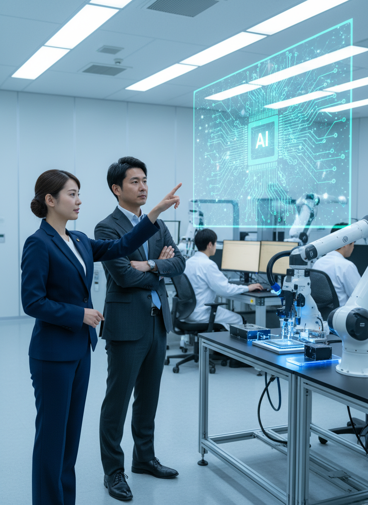

# AI/IT株式ニュース

2025/12/04

本日の注目トピック

---

<!-- _class: summary -->
# 本日のサマリー

今日のAI/IT市場は、大手テクノロジー企業のAI戦略の多角化と、それに対する規制当局の監視強化が顕著です。OpenAIは技術基盤強化のための買収を発表する一方、Googleや中国のCambriconはNVIDIAに代わる自社AIチップ開発・生産を加速させ、競争が激化しています。また、AI関連コストへの懸念や、Metaのメタバース事業からのシフトなど、投資と事業モデルの再構築が進む一日となり...

---

# M&A・企業買収

OpenAIがポーランドのスタートアップNeptuneを買収

---

# M&A・企業買収

MetaのAIパイオニアYann LeCunが退社し新AI企業を設立

---

# 戦略的提携・パートナーシップ

CambriconがAIチップ生産を3倍に、Nvidiaの中国市場の空白を狙う

---

# 戦略的提携・パートナーシップ

Armが次世代産業用AI向けアーキテクチャシフトを推進

---

# 大型契約・受注

ソフトバンクグループ出資のDayOne Data Centersが20億ドル超の資金調達を検討

---

# まとめ

本日のレポートは以上です

ご視聴ありがとうございました

---

# 塾頭高崎の完全自動化への挑戦

※このコンテンツはAIが自動生成しています

AI技術の限界に挑戦中！
共感いただけたらチャンネル登録・グッドボタンを
よろしくお願いします！
